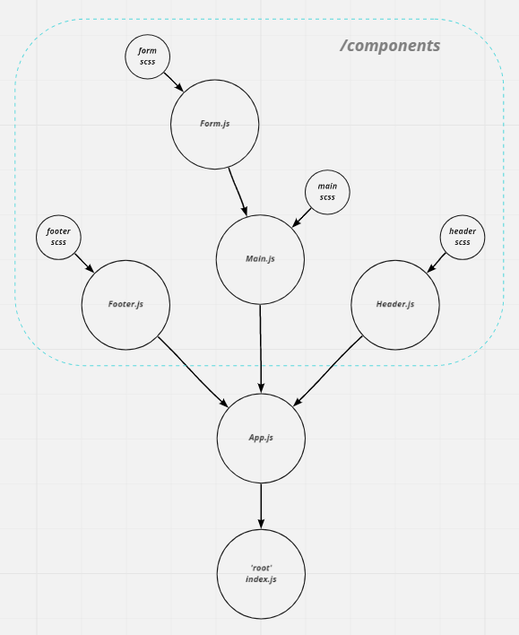
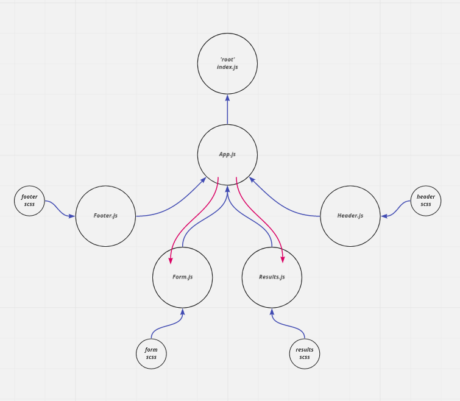

# Component Based UI

RESTy Phase 1: Begin work on the RESTy API testing application
RESTy Phase 2: Connect RESTy with APIs, running live requests

## Overview

### Lab 26
Today, we begin the first of a 4-Phase build of the RESTy application, written in React. In this first phase, our goal is to setup the basic scaffolding of the application, with intent being to add more functionality to the system as we go. This initial build sets up the file structure so that we can progressively build this application in a scalable manner

### Lab 27
In phase 2, we will be connecting RESTy to live APIs, fetching and displaying remote data. Our primary focus will be to service GET requests

## Author: William Moreno

## Getting Started

Site is deployed on Netlify [here](https://affectionate-panini-eca446.netlify.app/)

- clone repository
- cd into the directory
- `npm install` 
- `npm start` will run the app in development mode

## Features

### Lab 26
- `App.js` serves as a container for all subcomponents
  - imports `App.scss` as a base design
  - imports `Header.js`, `Main.js` and `Footer.js` using import syntax
- `Header.js` uses its own `.scss` file
- `Footer.js` uses its own `.scss` file
- `Main.js` uses its own `.scss` file
  - imports `Form.js` using import syntax
- `Form.js` uses it's own `.scss` file
  - accepts user input for a URL and stores it to state
  - allows user to choose a method and stores it in state
  - displays the user's choices in a separate `
`

### Lab 27
- `App.js` serves as a container for all subcomponents
  - holds state: Count and Results Array
  - has a class method that can update state
  - renders 4 Child Components
- `<Form />`
  - `updateResults` function sent to it as a prop
  - renders a URL entry form
  - supplies a selection of REST methods to choose from
    - 'GET' is the default
  - on submit:
    - sends API results back to `App.js` using the method sent down in props
- `<Results />`
  - receives props including headers and results
  - renders the result headers as "pretty" JSON
  - renders the result body as "pretty" JSON

## UML & Resources

[React Documents](https://reactjs.org/docs/getting-started.html)

## Create-React-App Information

### Getting Started with Create React App

This project was bootstrapped with [Create React App](https://github.com/facebook/create-react-app).

### Available Scripts

In the project directory, you can run:

#### `npm start`

Runs the app in the development mode.\
Open [http://localhost:3000](http://localhost:3000) to view it in the browser.

The page will reload if you make edits.\
You will also see any lint errors in the console.

#### `npm test`

Launches the test runner in the interactive watch mode.\
See the section about [running tests](https://facebook.github.io/create-react-app/docs/running-tests) for more information.

#### `npm run build`

Builds the app for production to the `build` folder.\
It correctly bundles React in production mode and optimizes the build for the best performance.

The build is minified and the filenames include the hashes.\
Your app is ready to be deployed!

See the section about [deployment](https://facebook.github.io/create-react-app/docs/deployment) for more information.

#### `npm run eject`

**Note: this is a one-way operation. Once you `eject`, you can’t go back!**

If you aren’t satisfied with the build tool and configuration choices, you can `eject` at any time. This command will remove the single build dependency from your project.

Instead, it will copy all the configuration files and the transitive dependencies (webpack, Babel, ESLint, etc) right into your project so you have full control over them. All of the commands except `eject` will still work, but they will point to the copied scripts so you can tweak them. At this point you’re on your own.

You don’t have to ever use `eject`. The curated feature set is suitable for small and middle deployments, and you shouldn’t feel obligated to use this feature. However we understand that this tool wouldn’t be useful if you couldn’t customize it when you are ready for it.

### Learn More

You can learn more in the [Create React App documentation](https://facebook.github.io/create-react-app/docs/getting-started).

To learn React, check out the [React documentation](https://reactjs.org/).

#### Code Splitting

This section has moved here: [https://facebook.github.io/create-react-app/docs/code-splitting](https://facebook.github.io/create-react-app/docs/code-splitting)

#### Analyzing the Bundle Size

This section has moved here: [https://facebook.github.io/create-react-app/docs/analyzing-the-bundle-size](https://facebook.github.io/create-react-app/docs/analyzing-the-bundle-size)

#### Making a Progressive Web App

This section has moved here: [https://facebook.github.io/create-react-app/docs/making-a-progressive-web-app](https://facebook.github.io/create-react-app/docs/making-a-progressive-web-app)

#### Advanced Configuration

This section has moved here: [https://facebook.github.io/create-react-app/docs/advanced-configuration](https://facebook.github.io/create-react-app/docs/advanced-configuration)

#### Deployment

This section has moved here: [https://facebook.github.io/create-react-app/docs/deployment](https://facebook.github.io/create-react-app/docs/deployment)

#### `npm run build` fails to minify

This section has moved here: [https://facebook.github.io/create-react-app/docs/troubleshooting#npm-run-build-fails-to-minify](https://facebook.github.io/create-react-app/docs/troubleshooting#npm-run-build-fails-to-minify)
